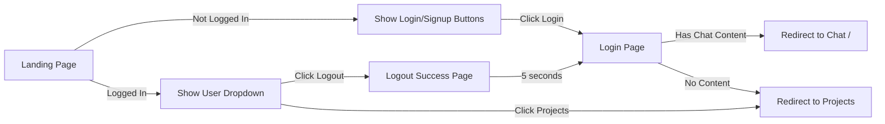

# Authentication & Login Design System

## Overview
This document outlines the design system for the authentication flow in VibeCoding, including login, logout, and project management interfaces.

## Design Philosophy
The authentication system follows a "vibes-first" approach, emphasizing:
- **Friendly & Approachable**: Using conversational language and encouraging messaging
- **Brand Consistency**: Blue gradient themes throughout the auth flow
- **Seamless Transitions**: Smart redirects based on user context
- **Progressive Disclosure**: Showing the right amount of UI based on auth state

## Color Palette

### Primary Colors
- **VibeCoding Blue**: `#2563eb` (blue-600)
- **VibeCoding Dark Blue**: `#1e40af` (blue-800)
- **Gradient**: `from-blue-600 to-blue-800`

### Supporting Colors
- **Success**: `#10b981` (green-500)
- **Info Light**: `#dbeafe` (blue-50)
- **Text Primary**: `#1f2937` (gray-800)
- **Text Secondary**: `#6b7280` (gray-600)
- **Border**: `#e5e7eb` (gray-200)

## Typography

### Font Stack
- System font stack via Tailwind defaults
- Consistent use of `font-semibold` for headings
- `font-medium` for buttons and CTAs

### Size Scale
- **H1**: `text-3xl` (30px) - Page titles
- **H2**: `text-2xl` (24px) - Section headers
- **H3**: `text-lg` (18px) - Card titles
- **Body**: `text-sm` (14px) - General text
- **Small**: `text-xs` (12px) - Metadata and hints

## Component Library

### 1. Authentication Buttons

#### Primary Action Button
```html
<button class="w-full px-4 py-3 bg-blue-600 text-white rounded-lg hover:bg-blue-700 transition-colors font-medium">
  Login
</button>
```

#### Secondary Action Button
```html
<button class="w-full px-4 py-3 bg-white text-gray-700 border border-gray-300 rounded-lg hover:bg-gray-50 transition-colors font-medium">
  Sign Up
</button>
```

#### OAuth Buttons (Disabled State)
```html
<button disabled class="w-full flex items-center justify-center gap-3 px-4 py-3 border border-gray-300 rounded-lg hover:bg-gray-50 transition-colors opacity-50 cursor-not-allowed">
  <svg><!-- icon --></svg>
  <span>Login with GitHub</span>
</button>
```

### 2. User Avatar Dropdown

#### Avatar Button
```html
<div class="w-8 h-8 bg-blue-600 rounded-full flex items-center justify-center text-white font-medium">
  {{.UserInitial}}
</div>
```

#### Dropdown Menu
```html
<div class="hidden absolute right-0 mt-2 w-48 bg-white rounded-lg shadow-lg border border-gray-200 z-50">
  <a href="/projects" class="block px-4 py-2 text-sm text-gray-700 hover:bg-gray-100">Projects</a>
  <hr class="border-gray-200">
  <form action="/logout" method="POST">
    <button type="submit" class="w-full text-left block px-4 py-2 text-sm text-gray-700 hover:bg-gray-100">Logout</button>
  </form>
</div>
```

### 3. Project Cards

```html
<a href="/?project={{.ID}}" class="block bg-white rounded-lg shadow hover:shadow-lg transition-shadow border border-gray-200">
  <div class="p-6">
    <!-- Type Badge -->
    <span class="inline-flex items-center px-2.5 py-0.5 rounded-full text-xs font-medium bg-blue-100 text-blue-800">
      {{.Type}}
    </span>

    <!-- Title -->
    <h3 class="text-lg font-semibold text-gray-900 mb-2">{{.Name}}</h3>

    <!-- Stats -->
    <div class="flex items-center gap-4 text-sm text-gray-600">
      <span>{{.FileCount}} files</span>
      <span>{{.LineCount}} lines</span>
    </div>

    <!-- Metadata -->
    <div class="text-xs text-gray-500">
      <div>Created: {{.CreatedAt}}</div>
      <div>Updated: {{.UpdatedAt}}</div>
    </div>
  </div>
</a>
```

### 4. Form Inputs

```html
<input type="email"
       class="w-full px-3 py-2 border border-gray-300 rounded-lg focus:outline-none focus:ring-2 focus:ring-blue-500"
       placeholder="you@example.com">
```

## Page Layouts

### Login Page (`/login`)

#### Desktop Layout (lg:)
- **Left 1/3**: Hero section with gradient background
  - VibeCoding branding
  - Value propositions with icons
  - Blue gradient: `bg-gradient-to-br from-blue-600 to-blue-800`

#### Mobile Layout
- Full-width form without hero section
- Maintains all form functionality
- Responsive padding adjustments

#### Key Features
- OAuth placeholder buttons (future implementation)
- Email/password fields
- Remember me checkbox
- Smart redirect based on `hasContent` query param

### Projects Page (`/projects`)

#### Layout Structure
```
Header (with user dropdown)
├── Search Bar
├── New Project Button
└── Project Grid (1-3 columns responsive)
```

#### Responsive Grid
- Mobile: 1 column
- Tablet (sm:): 2 columns
- Desktop (lg:): 3 columns

#### Empty State
- Centered icon and message
- Clear CTA to create first project

### Logout Success Page (`/logout`)

#### Visual Design
- Full-screen gradient background
- Centered white card with shadow
- Logout icon in blue circle
- Success messaging with "vibe" language

#### Key Features
- Auto-redirect after 5 seconds
- "Login Again" CTA button
- Animated dots for visual interest
- Meta refresh tag for redirect

## Navigation Patterns

### Authentication Flow



### Smart Content Detection
When users click login/signup buttons, JavaScript checks for existing chat content:
```javascript
function checkChatContent() {
    const messages = document.getElementById('messages');
    const messageElements = messages.querySelectorAll('.bg-blue-100, .bg-gray-100');
    return messageElements.length > 0;
}
```

## Session Management

### Cookie Strategy
- `auth_session`: HTTP-only cookie for auth state
- `session`: HTTP-only cookie for OpenCode session mapping
- 7-day expiration for auth sessions
- SameSite=Lax for CSRF protection

### Auth Middleware Pattern
```go
func (s *Server) requireAuth(next http.HandlerFunc) http.HandlerFunc {
    return func(w http.ResponseWriter, r *http.Request) {
        if !s.isAuthenticated(r) {
            http.Redirect(w, r, "/login", http.StatusSeeOther)
            return
        }
        next(w, r)
    }
}
```

## Responsive Breakpoints

Following Tailwind's default breakpoints:
- **Mobile First**: Default styles
- **sm (640px)**: Tablet adjustments
- **lg (1024px)**: Desktop layouts

## Accessibility Considerations

### Form Elements
- Proper label associations
- Placeholder text as hints, not labels
- Focus states with ring utilities
- Keyboard navigation support

### Color Contrast
- All text meets WCAG AA standards
- Interactive elements have clear hover states
- Disabled states visually distinct

### Navigation
- Dropdown menus keyboard accessible
- Form submission works without JavaScript
- Proper heading hierarchy maintained

## Implementation Notes

### Template Structure
```
templates/
├── login.html        # Login page template
├── logout.html       # Logout success page
├── projects.html     # Projects listing page
└── index.html        # Main app with auth UI
```

### Route Handlers
- `GET/POST /login`: Login page and processing
- `POST /logout`: Clear session and show success
- `GET /projects`: Protected projects page
- Auth state passed to all templates

### HTMX Considerations
- Logout uses standard form POST, not HTMX
- Prevents partial page replacement issues
- Ensures full page navigation for auth changes

## Future Enhancements

### Planned Features
1. **OAuth Integration**: GitHub and Google login
2. **Password Reset**: Forgot password flow
3. **Email Verification**: Account activation
4. **Two-Factor Auth**: Enhanced security
5. **Project Thumbnails**: Visual project previews
6. **Usage Analytics**: Display in logout message

### Design System Extensions
1. **Dark Mode**: Theme toggle support
2. **Loading States**: Skeleton screens
3. **Error States**: Friendly error pages
4. **Notifications**: Toast messages
5. **Onboarding**: First-time user flow

## Conclusion

The VibeCoding authentication design system prioritizes user experience through:
- Clean, modern visual design
- Thoughtful micro-interactions
- Smart context-aware navigation
- Consistent brand voice ("vibes")
- Responsive, accessible implementation

This foundation provides a scalable system for future authentication and user management features while maintaining the playful, approachable character of the VibeCoding brand.